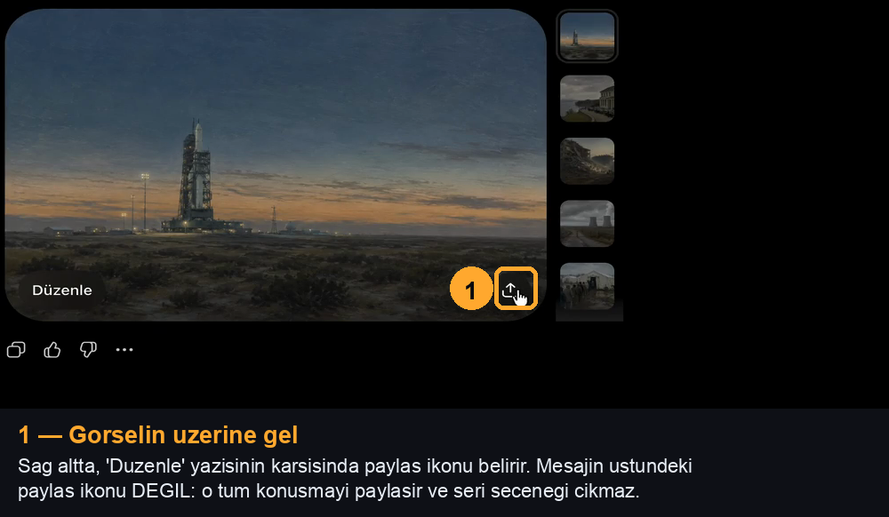
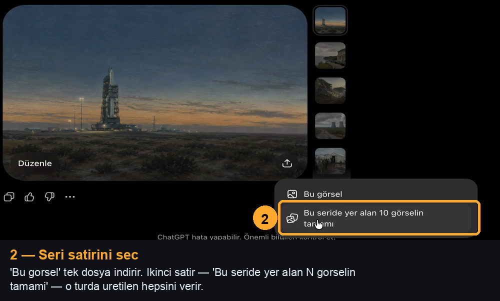
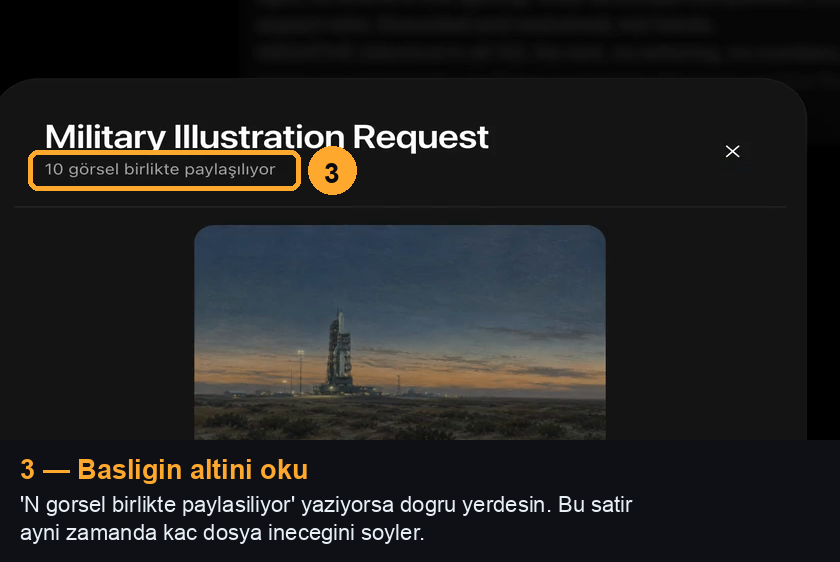
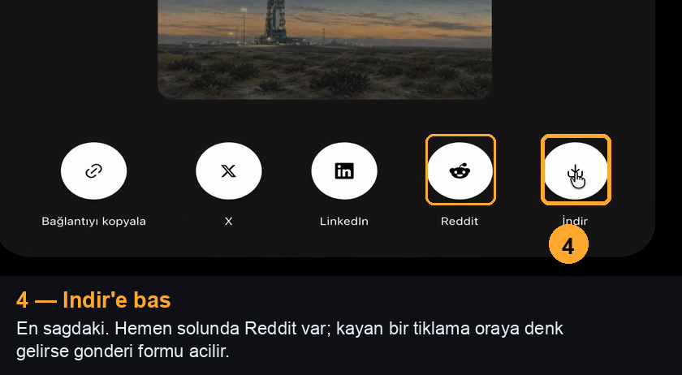
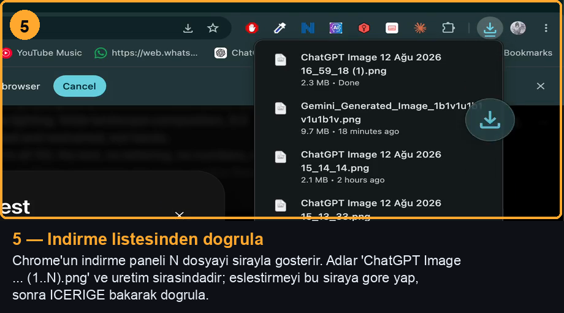

# /image-run — ChatGPT'de uctan uca gorsel uretimi

Kullanicinin kendi Chrome'unda gorselleri uretir ve indirir: **istek toplu, indirme teker teker**. Hangi
sohbette calisilacagini **kendisi cozer** — bkz. 0. adim. Prompt yazimi ve palet
dogrulamasi ayri bir skill'in isi:
**[/image-prompt](../image-prompt/SKILL.md)** — once oradaki toplu istek
formatini (10 konu, damga sonda) ve sepya/kolaj tuzaklarini oku, prompt metnini oradaki kurallara gore uret.
Bu skill o promptlari **calistirir**.

Arac: `mcp__claude-in-chrome__*` (kullanicinin gercek, oturumu acik Chrome'u).
Uygulama ici tarayici (`mcp__Claude_Browser__*`) **kullanilmaz** — ChatGPT'ye
login degil, dosya ucu 401 doner.

---

## Akis — tek istek, sirayla uretim, teker teker indirme

```
sohbeti ac  →  10 konuluk TEK mesaj gonder (damga en sonda)
                          ↓
              model konulari sirayla uretir
                          ↓
        her gorsel bittikce onu INDIR + dogrula + adlandir
                          ↓
              tur bitince sonraki 10'luk mesaj
```

**Bir mesaj, on konu, bir istek.** Uretim yine teker teker olur ama gonderilen istek
sayisi 10 kat duser — cok sayida arka arkaya istek kotayi ve oturumu zorluyor.
Parcalama: 3 istiyorsan 3, 15 istiyorsan 10 + 5, 30 istiyorsan 10 + 10 + 10.
Prompt formati ve **damganin en sonda** durmasi: [/image-prompt](../image-prompt/SKILL.md)
Kural 1.

**Indirme toplu yapilmaz.** Her gorsel bittikce tek tek indirilir ve diskte dogrulanir.
Toplu "seri indir" akisi bir kez ayni seriyi ikinci kez indirdi, bir kez de pozisyon
kaymasi uretti. Kullanicinin talimati da acik: *"birde teker teker indir"*.

---

## Model ve efor — kotayi burada koru

Bu skill'in isi ikiye ayrilir ve **ayni modelle yapilmaz**:

| is | model / efor | neden |
|---|---|---|
| Prompt yazimi (`/image-prompt`) | **ana model, normal efor — asla low** | Stil blogu, kadraj dagilimi, sepya/kolaj tuzaklari muhakeme isi. Ucuzlatilan prompt tum turu cope atar; 10 gorsel yeniden uretmek her tasarrufu geri alir |
| Gonder / bekle / kontrol / indir / esle | **Sonnet 5, `effort: low`** | Mekanik: sabit DOM secicileri, sabit tiklama sirasi. Bu dosyada adim adim yazili, muhakeme gerekmiyor |

Calistirma dongusunu **arka plan `Agent`'ina devret** — tek gorselde bile:

```
Agent(subagent_type: "general-purpose", model: "sonnet", effort: "low",
      run_in_background: true)
```

Prompt metni ajana **hazir** verilir; ajan prompt yazmaz, degistirmez, "iyilestirmez".
Gorevi: sohbeti ac → yapistir → Return → 1 dk'da bir kontrol → indir → dosyalari
esle → rapor. Ana hat bu sirada proje isine devam eder.

**Haiku secme.** Composer ve sohbet secimi yanlis dugumu tiklamaya musait; bu skill'in
gecmisinde kor tiklama bir kez Reddit gonderi formunu acti, bir kez de ajan paylas
penceresinde asili kalip watchdog'a dustu. Sonnet low bu adimlari guvenle yuruturken
Opus'un maliyetinin kucuk bir kismini harcar.

**Efor'u yukselt** sadece su iki durumda: kolaj geldi ve promptun neden bozuldugunu
teshis etmek gerekiyor, ya da indirme akisi UI degisikligi yuzunden tutmuyor.
Teshis ana hatta yapilir, duzeltilmis prompt yine low ajana verilir.

---

## Saglayici — ChatGPT birincil, kota bitince Gemini

ChatGPT'nin gorsel kotasi bir batch'in ortasinda bitebiliyor. **Kota bitti diye isi
birakma, Gemini'ye gec** ve kalan batch'leri orada uret.

| durum | ne yap |
|---|---|
| ChatGPT normal calisiyor | ChatGPT'de kal |
| "You've reached your limit for image generation" / gorsel butonu pasif / uretim baslamiyor | Gemini'ye gec, **kalan** dosyalari orada uret |
| Gemini de reddediyor | Dur, kullaniciya soyle — bos batch gonderip durma |

**Yarim kalan batch'i bastan uretme.** ChatGPT'de inen dosyalari koru, Gemini
promptunda sadece **eksik kalan numaralari** iste. Stil blogunu harfi harfine ayni
tasi; iki saglayicinin ciktisi arasindaki fark zaten yeterince buyuk, bir de prompt
degistirirsen seri tutmaz.

Gecis oldugunda kullaniciya **tek satirla** haber ver:
`ChatGPT gorsel kotasi bitti — kalan N dosyayi Gemini'de uretiyorum.`

### Gemini'de calistirma

`https://gemini.google.com/app?hl=tr` — kullanicinin Chrome'unda oturum acik.

Composer **Quill** editoru, ChatGPT'ninki gibi degil. **ChatGPT'nin
`ClipboardEvent('paste')` yontemi Gemini'de sessizce hicbir sey yazmaz** — editor bos
kalir, sen yazildi sanirsin. Calisan yontem `insertText`:

```js
const el = document.querySelector('div.ql-editor[contenteditable="true"]');
el.focus();
document.execCommand('insertText', false, PROMPT);
```

**GONDER DUGMESINE `.click()` ILE BASMA — SESSIZCE HICBIR SEY OLMAZ.** Gemini'nin
gonder dugmesi Angular Material; programatik `.click()` uc denemede de tetiklemedi ve
her seferinde "gonderdim" sanildi. Calisan tek yol otomasyon katmanindan **gercek
tiklama** (`computer` araci, ekran koordinatiyla). Gonderdikten sonra `el.innerText`
bos mu diye **kontrol et**; bos degilse mesaj gitmemistir.

**Sohbet degistiyse metni yazma.** Sekme baska bir sohbete kaymis olabilir; yazmadan
once `document.title` / URL'yi dogrula. Yanlis sohbete uzun bir prompt yapistirmak
sessiz bir hata.

Gemini bir turda ChatGPT kadar hizli vermiyor ama **8 konuluk referanssiz sablon
8/8 dondu** (2026-08-10). Kac dosya dondugunu ilk turda **say**: gorseller tembel
yuklendigi icin `img` sayisi az gorunur — dogru sayac sayfadaki **"Tam boyutlu resmi
indir" dugmelerinin adedidir.

#### Indirme — Gemini'de TOPLU INDIRME YOK, ve uretilemez de

Uc yol denendi, ucu de olculdu (2026-08-10):

| yol | sonuc |
|---|---|
| Sayfa icinden `fetch(url)` -> blob -> `<a download>` | **0/3.** Gemini'nin gorsel URL'leri CORS'a kapali. (ChatGPT'de bu yol calisiyor.) |
| Gorsel basina "Tam boyutlu resmi indir" dugmesine sentetik `.click()` | Buton "8/8 tetiklendi" der, diske **1 dosya** duser. Material dugmesi sentetik olayi yutuyor. |
| Gemini'ye zip sor | Reddediyor: "tek bir tikla veya .zip arsivi olarak toplu indirme ozelligi bulunmuyor". |

Yani **sayfaya enjekte edilen bir "tumunu indir" butonu Gemini'de calismaz.** Toplu
indirme gerekiyorsa seti **ChatGPT'de uret** — orada seri paylasim penceresinden
tek tikla tamami iniyor. Gemini'de kalinacaksa dosyalar tek tek, gorselin kendi
indirme ikonuna **gercek tiklama** ile alinir.

#### Saydamlik guvenilir degilse: DUZ ANAHTAR RENK iste

Gemini bazen gercek alfa veriyor (dama tahtasi gorunur), bazen vermiyor. Alfa
sartsa prompta su yedegi **her zaman** ekle — boylece kesilemeyen bir cikti
gelmez:

```text
If you cannot output a real alpha channel, do NOT fake it. Instead put the object
on a COMPLETELY FLAT, UNIFORM background in a single colour that appears nowhere in
the object itself: a saturated blue (#1B34FF). Fill the entire background with
exactly that one colour — no gradient, no vignette, no texture, no shadow falling
onto the background, no lighter patch behind the object. The object must not touch
the canvas edge.
```

Anahtar renk **konuya gore** secilir: paletin hicbir yerinde olmayan doygun bir renk.
Sicak krem/kahve/adacayi bir set icin doygun mavi dogru; gri golgelerle karisir,
beyaz krem nesnelerle karisir. Magenta kullanma — kullanicinin acik kurali.
Gelen dosya `cozy-critter-cafe/tools/pack_art.py` icindeki `_cut_flat_bg` ile
kesilir: kenardan bagli zemini rampali kenarla siler, nesnenin ICINDEKI ayni rengi
korur, zemini boyali olani olcup atlar.

Dosya adlari yine **icerige bakarak** eslenir — Gemini'nin indirdigi adlar prompt
sirasini hic tasimiyor.

---

## 0. Sohbet adini coz — kullaniciya sorma

Sohbet adi **hicbir zaman** bloklayan bir soru degildir. Su sirayla coz:

| oncelik | kaynak | aksiyon |
|---|---|---|
| 1 | Bu calistirmada argüman olarak verildi | Onu kullan **ve kaydet** (asagi) |
| 2 | Kayitli sohbet adi var | Sessizce onu kullan, kullaniciya tek satir bildir |
| 3 | Hicbiri yok | **Kendin yeni bos sohbet ac** ve orada uret |

**Kayit yeri:** `~/.claude/projects/-Users-musabkara/memory/reference_image-run-chat.md`
(`metadata.type: reference`). `MEMORY.md` indeksine tek satir pointer ekle.

```bash
CHAT_MEMO=~/.claude/projects/-Users-musabkara/memory/reference_image-run-chat.md
[ -f "$CHAT_MEMO" ] && grep -m1 '^chat:' "$CHAT_MEMO"
```

Kullanici yeni bir sohbet adi verdiginde bu dosyayi **uzerine yaz** — iki farkli
ad birikirse sonraki calistirma yanlis sohbete yazar. Kullanici "artik su sohbette
uret" derse yeni ad kazanir.

**Onceki adi kullandiginda bunu tek satirla soyle**, sessizce baska sohbete yazma:
`Kayitli sohbette devam ediyorum: "<ad>".`

### 3. durum — kendi sohbetini ac

Kullaniciya "hangi sohbette ureteyim?" diye **sorma.** Yeni sekme ac, `chatgpt.com`
kokune git, dogrudan promptu gonder — ChatGPT ilk mesajdan sonra sohbete kendi
adini verir.

```
navigate → https://chatgpt.com/
composer'a promptu yapistir (bkz. 2. adim) → Return
ilk yanit basladiktan sonra sohbet adini kenar cubugundan oku
```

Ad olustugunda:
1. Kullaniciya bildir: `Yeni sohbet actim: "<ad>" — bundan sonra burada uretecegim.`
2. Adi yukaridaki memo dosyasina yaz ki sonraki calistirma ayni yerde devam etsin.

ChatGPT bazen ada gec karar veriyor; ad henuz gelmediyse ilk gorsel bitiminde tekrar
oku. Ad okunana kadar uretimi bekletme.

---

## 1. Sohbeti ac

0. adimda cozulen ad icin kenar cubugundan **ada gore** bul ve tikla — URL tahmin
etme, isim tek dogruluk kaynagi:

```js
const name = 'SOHBET ADI';
const el = [...document.querySelectorAll('a, li, div')]
  .find(n => n.textContent.trim().startsWith(name) && n.closest('nav'));
el?.scrollIntoView({block:'center'});
```

Ad kayitliydi ama sohbet listede yoksa (silinmis, arsivlenmis) → 0. adimin 3.
durumuna dus: yeni sohbet ac, memo'yu yeni adla guncelle. **Benzer isimli baska
bir sohbete yazma.**

Ayni sohbette devam etmek surekliligi saglar: stil blogu ayni yerde birikir,
kullanici hangi gorselin nerede uretildigini takip edebilir.

**Ayni projede kal.** Kayitli sohbet yalnizca **ayni proje icinde** varsayilandir; yeni
bir proje **yeni sohbet** acar. Bir kez baska projenin sanat sohbetine prompt gonderildi
ve kullanici durdurdu: *"yanlis yerden indiriyorsun sifirdan ac"*.

---

## 2. Damgali promptu gonder

Damga kim/ne zaman/hangi tur bilgisini tasir; kullanici kendi elle attigi promptlarla
senin gonderdiklerini ayirt edebilsin, eski turlar yanlislikla tekrar indirilmesin.

**Damga EN SONDA durur.** Ilk satir uretim talimati olmali:

```
Generate 10 separate images, one for each numbered subject below.   <- ILK SATIR
IMPORTANT: output each as its OWN separate image file. ...

STYLE (identical in all 10): ...
LIGHT (identical in all 10): ...
NEGATIVE (identical in all 10): ...

1. ...
10. ...

[CLAUDE — 2026-08-10 14:30 — <proje>, <tur adi>]                    <- DAMGA, EN SON
```

**Damga uretim talimatinin onune gecemez.** 2026-08-09'da damga gercekten en basa kondu,
`Generate 10 separate images` ilk satir olmaktan cikti ve model tum istegi tek konu sanip
**tek birlesik tuval** uretti. Sonrasinda damga ikinci satira alindi, ardindan toplu format
tamamen birakildi — ikincisi asiri duzeltmeydi. Damga **listenin altinda**, numarasiz ve
bos satirla ayrilmis dururken toplu format calisiyor.

Damga ile numarali listenin arasina **bos satir birak** — damganin 11. konu
sanilmamasi icin ayri durmasi gerekiyor.

Damgaya **kart/konu id listesi yazma** — model onu ek konu sanabiliyor. Proje adi,
tarih-saat ve tur adi yeter.

Tarihi **calistirma aninda** uret, uydurma.

**Prompt metni Ingilizce olmali** (bkz. `/image-prompt` Kural 0) — damga satiri
disinda her sey. Turkce prompt gorsel kalitesini dusuruyor.

Composer bir `contenteditable` div. `textarea.value` set etmek **calismaz**
(React state guncellenmiyor). Once `insertText` dene, tutmazsa `ClipboardEvent`:

```js
const el = document.querySelector('#prompt-textarea') || document.querySelector('div[contenteditable="true"]');
el.focus();
document.execCommand('selectAll', false, null);
document.execCommand('delete', false, null);

// 1. tercih — 2026-08-10'da guvenilir calisan yontem
document.execCommand('insertText', false, PROMPT);

// tutmazsa 2. yol:
// const dt = new DataTransfer(); dt.setData('text/plain', PROMPT);
// el.dispatchEvent(new ClipboardEvent('paste', {clipboardData: dt, bubbles: true, cancelable: true}));
```

**Yapistirmayi her zaman geri okuyarak dogrula.** Ikisi de **asenkron** uygulanabiliyor;
hemen ardindan gonderirsen bos mesaj gider:

```js
await new Promise(r => setTimeout(r, 1000));
el.textContent.length          // prompt uzunlugu ile kabaca ortusmeli
```

Uzunluk sifir ya da kisaysa temizle ve tekrar yapistir. 2026-08-10'da `ClipboardEvent`
bir oturumda `length` 0 birakti ve `insertText` ile cozuldu; ayni gun baska bir ajanda
`ClipboardEvent` calisti ama gecikmeli uygulandi. Ikisi de olabilir — **dogrulama**
pazarlik konusu degil.

Sonra gonder. **Tercihen DOM'dan**, `computer` ile degil — birden fazla sekmede paralel
calisiyorsan `computer` on plandaki sekmeye vurur ve baska bir ajanin isini bozar:

```js
(document.querySelector('[data-testid="send-button"]') ||
 [...document.querySelectorAll('button')].find(x => /send|gönder/i.test(x.getAttribute('aria-label')||''))
).click();
```

---

## 3. Kontrol dongusu

Bekleme icin `Bash` + `run_in_background: true` ile `sleep 60` kullan — bittiginde
bildirim gelir, sen de kontrolu yaparsin. Onplanda `sleep` bloklu.

```js
const turns = [...document.querySelectorAll('[data-testid^="conversation-turn"], article')];
const shots = [];
for (const t of turns) {
  const im = [...t.querySelectorAll('img')]
    .filter(i => /oaiusercontent|sediment|backend-api|files/.test(i.currentSrc || i.src || ''));
  if (im.length) shots.push(im[0]);
}
const stop = [...document.querySelectorAll('button')]
  .some(b => /stop|durdur/i.test((b.getAttribute('aria-label')||'') + (b.getAttribute('data-testid')||'')));
({ stillGenerating: stop, shotCount: shots.length })
```

`stillGenerating` false **ve** `shotCount` bir artmissa bitmistir.

**`naturalWidth`'i hazir olma sinyali olarak KULLANMA.** Sekme on planda degilse Chrome
gorsel cozmeyi erteliyor: gorsel gercekten hazir oldugu halde `naturalWidth` 0 ve
`complete` false kaliyor. Paralel kosuda sekmelerin cogu arka plandadir, yani bu olcut
sonsuza kadar bekletir. Sayim **DOM'daki tur sayisina** dayanir; gercek dogrulama
indirme adimindaki `blob.type` kontroludur.

Sureyi de kucumseme: tek basina 1-2 dk, 10 sekme paralelken **2-5 dk** olcusuldu.
`sleep 60` ile birkac tur beklemeyi normal say.

"ChatGPT hata yapabilir" sayfa altyazisidir — hata sanip alarm verme.

### Kolaj kontrolu — gorursen iptal et, bastan gonder

Tek gorsel istendigi halde **izgara / contact sheet / bolunmus tuval** geldiyse o
gorsel curuktur. Bekleme, duzeltmeye calisma:

1. Uretim suruyorsa **durdur** (stop butonu).
2. Promptu **duzelt** — ilk satir `Generate one image.` olmali, damga ikinci satirda
   (bkz. 2. adim). Promptta birden fazla konu varsa boldur; her mesaj tek konu tasir.
3. Ayni promptu **bastan gonder**.

Tespit: tek gorsel istenmisken cikti birden fazla panele bolunmusse ya da en/boy orani
istenen kadrajdan sapiyorsa kolaj uretilmis demektir. Ekran goruntusuyle dogrula.

Kolaj geleni **indirmeye calisma** — bosuna tur yakar ve yanlis dosya Downloads'a
duser, sonraki eslemeyi bozar.

---

## 4. Gorseli indir — sayfa ici fetch, paylas menusune GIRME

**Dogrulanmis yontem (2026-08-10).** Paylas menusunu hic acma; gorseli sayfanin kendi
oturumuyla indir. Ad da burada verilir, sonradan eslestirme derdi kalmaz:

```js
// Gorselleri KONUSMA SIRASINA gore sec — URL'e gore ayikla DEME (bkz. asagidaki tuzak)
const turns=[...document.querySelectorAll('[data-testid^="conversation-turn"], article')];
const shots=[];
for(const t of turns){
  const im=[...t.querySelectorAll('img')]
    .filter(i=>/oaiusercontent|sediment|backend-api|files/.test(i.currentSrc||i.src) && i.naturalWidth>400);
  if(im.length) shots.push(im[0]);             // her tur en fazla bir uretilmis gorsel
}
const img = shots[shots.length-1];             // en son uretilen
const url = img.currentSrc || img.src;         // currentSrc BOS olabilir — bkz. asagi
const r = await fetch(url);
const b = await r.blob();
let saved = false;
if (b.type.startsWith('image/') && b.size > 400000) {   // KAPI: tip ve boyut
  const a = document.createElement('a');
  a.href = URL.createObjectURL(b);
  a.download = 'wildbound-03.png';             // ADI SEN VER
  document.body.appendChild(a); a.click(); a.remove();
  saved = true;
}
({ok:r.ok, type:b.type, kb:Math.round(b.size/1024), saved, shotCount:shots.length});
```

`saved:true`, makul bir `kb` **ve** `shotCount`'un bir artmis olmasi — ucu birden
olmadan sonraki adima gecme.

### Tuzak: `ok:true` gorseli geldi anlamina GELMEZ

Gorsel henuz lazy-load olmadiysa `img.currentSrc` **bos string**tir. `fetch('')` hata
vermez — sayfanin kendi URL'ine cozulur ve **ChatGPT SPA kabugunu** doner: `ok:true`,
~476 KB, ve diske `.png` adiyla yazilan bir HTML dosyasi. 2026-08-10'da iki dosya boyle
bozuldu ve checksum kontrolu bile yakalayamadi (iki HTML birbirinden farkliydi).

Uc katmanli korunma, ucu de gerekli:

1. `img.currentSrc || img.src` — currentSrc bossa src doludur.
2. `blob.type.startsWith('image/')` — `r.ok`'a **guvenme**, tipe bak.
3. Diske yazdiktan sonra: `file -b --mime-type <dosya>` → `image/png` degilse sil ve
   tekrar indir.

### Bir turda uretilen HEPSINI tek seferde indir — seri menusu

Toplu bir istek bir SERI uretir, ve seri kendi indirme yolunu tasir: on gorseli tek tek
kurtarmaya calismak yerine on tanesini birlikte indirir. Ekran kaydindan cikarildi
(2026-08-12).











#### Tuzak: pencere sayfa yuklemesi basina ILK gorsele kilitlenir

Bu pencereyi tek gorseller icin arka arkaya kullanma. Ikinci paylas tiklamasi ayni
pencereyi geri getirir — baslik degismez — ve **ayni dosyayi tekrar indirirsin**.
2026-08-12'de sekiz indirme yapildi, sekizinin de MD5'i ayniydi, ve dort karta yanlis
tablo yazildi; geri almak icin `git checkout` gerekti.

Iki korunma, ikisi de gerekli:

1. Her indirmeden once pencerenin **basligini oku** ve bekledigin gorselle esles.
   Eslesmiyorsa sayfayi yenile — yenileme kilidi acar.
2. Diskte **icerige bak**. Sira dogru olsa bile bir kez gozle dogrulamadan karta yazma.

Tek gorsel icin bu menuyu hic acma: yukaridaki sayfa ici `fetch` yolu adi da veriyor ve
kilitlenme sorunu yok. Seri menusu yalnizca SERI icindir.

### Yedek: `fetch` engellenirse native indirme

Bazi oturumlarda tarayici araci imzali query string'i tasiyan istegi engelliyor
(`BLOCKED: Cookie/query string data`) ve `fetch` hic calismiyor. O zaman istegi JS'e
okutma, tarayiciya yaptir:

```js
const a = document.createElement('a');
a.href = img.currentSrc || img.src;
a.download = '';                                // cross-origin'de ad yok sayilir
document.body.appendChild(a); a.click(); a.remove();
```

Dosya `~/Downloads`'a **UUID benzeri kendi adiyla** iner (cross-origin istek `download`
adini yok sayar), sonra `mv` ile dogru ada tasinir. Bu yolda tip dogrulamasi yalnizca
diskte yapilabilir — `file -b --mime-type` adimi burada zorunludur.

### Tuzak: URL'e gore tekillestirme calismaz

Ilk surumde gorseller `src.split('?')[0]` ile tekillestiriliyordu. **Bu sessizce
coker:** ChatGPT'nin gorsel URL'leri **ayni yolu paylasir, yalnizca query string'de
ayrisir**, ustelik tarayici araci query string'i okumayi engelliyor (`[BLOCKED:
Cookie/query string data]`). Sonuc: butun gorseller tek bir kayda dusuyor ve her
indirme **ayni ilk gorseli** getiriyor. 2026-08-10'da 3. ve 4. stil boyle indi;
yalnizca checksum karsilastirmasi yakaladi.

Bu yuzden secim **DOM sirasina** dayanir, URL'e degil.

**Her indirmeden sonra checksum dogrula** — dosya adinin dogru olmasi icerigin dogru
oldugunu gostermez:

```bash
shasum ~/Projects/<proje>/art/*.png | awk '{print $1}' | sort | uniq -d
```

Cikti bossa hepsi farklidir. Tekrar eden hash varsa ayni gorsel iki kez inmistir.

**Neden paylas menusu degil:** o menude **Indir dugmesinin hemen yaninda Reddit var**
(sirasi: Baglantiyi kopyala · X · LinkedIn · Reddit · Indir). Bir kor tiklama bir kez
Reddit gonderi formunu acti, bir kez de ajan menude asili kalip watchdog'a dustu. Ayrica
o akis herkese acik bir paylasim baglantisi uretebiliyor. Sayfa ici fetch hicbirine
dokunmaz.

**Bir onceki gorseli indirmek gerekiyorsa** `uniq[uniq.length-1]` yerine indeksi degistir;
`uniq` dizisi sohbetteki sirayla gelir.

Menu yine de acildiysa (yanlis tiklama) **Escape** ya da sag ustteki X ile kapat —
composer o pencere acikken yaziyi almaz.

Onceki surumdeki "Bu seride yer alan N gorselin tamami" secenegi coklu-uretim akisindan
kalmadir; **kullanma**.

**Koordinat yerine DOM'dan tikla.** Sayfa uretim sirasinda kayiyor ve
ekran goruntusuyle alinan koordinat tiklama anina kadar geceriz oluyor. Butonlari
metniyle bul ve `.click()` et — kaymadan etkilenmez:

```js
// paylas ikonu (en sonuncusu = en son tamamlanan gorsel)
const shares = [...document.querySelectorAll('button')]
  .filter(b => /Bu görseli paylaş/i.test(b.getAttribute('aria-label') || ''));
shares[shares.length - 1].click();

// seri secenegi — en az ic ogeye sahip olani gercek menu satiri
const item = [...document.querySelectorAll('[role="menuitem"], button, div')]
  .filter(n => (n.textContent || '').trim() === 'Bu seride yer alan 10 görselin tamamı')
  .sort((a, b) => a.querySelectorAll('*').length - b.querySelectorAll('*').length)[0];
item.click();

// indir
[...document.querySelectorAll('button, a')].find(n => (n.textContent||'').trim() === 'İndir').click();
```

Metin eslesmesinde **en az ic ogeye sahip** dugumu sec — ayni metin hem sarmalayici
kapsayicida hem gercek satirda geciyor, sarmalayiciya tiklamak ise yaramiyor.

**Uc kural:**

1. **Her adimda once ekran goruntusu al, sonra tikla.** Bir dugmeye basip diske
   bakma — arada menu aciliyor. Bu hata bir kez "indirilemiyor" yanlis sonucuna
   goturdu.
2. **Asla kuyruga alinmis kor tiklama yapma.** Pencere acildiktan sonra ayni
   koordinat baska bir butona denk gelebiliyor; bir kez **Reddit** gonderi formu
   acildi (gonderilmedi, kapatildi). Tek `browser_batch` icinde "tikla + ayni
   yere tekrar tikla" dizisi kurma.
3. **"Bu gorsel" degil, seri secenegini sec.** Tek gorsel yolu ayni paylasim
   penceresini aciyor, sadece isi uzatiyor.

Bu akis gorsel(ler) icin **herkese acik bir baglanti uretebiliyor**
(`chatgpt.com/s/m_...`). Is bitince kullaniciya hatirlat: Ayarlar > Veri
kontrolleri > Paylasilan baglantilar'dan silinebilir.

---

## 5. Dosyalari esle

Inen dosya adlari anlamsiz (`ChatGPT Image ... (3).png`).

**Zaman penceresiyle dosya secme.** `son N dakikada inenler` veya `[-10:]` gibi
secimler kirilgan: baska bir uygulama ayni klasore dosya birakabilir, onceki
onceki gorselin kuyrugu pencereye girebilir. Bir kez **tam bir pozisyon kaymasina** yol
acti — infantry dusup yerine alakasiz bir grafik girdi, 10 kartin hepsi bir sira
kaydi ve build yesil kaldigi icin sessizce yanlis baglandi.

**Indirmeden once seri sayisinin ARTTIGINI dogrula.** Paylas dugmelerini
(`Bu görseli paylaş`) say; bu sayi her tamamlanmis gorsel serisi icin bir artar.
Indirmeye baslamadan onceki sayiyi hatirla:

```js
const groups = [...document.querySelectorAll('button')]
  .filter(b => /Bu görseli paylaş/i.test(b.getAttribute('aria-label') || '')).length;
```

`groups` bir artmadiysa **yeni gorsel daha bitmemistir**; `shares[son]` hala bir
onceki seriyi gosterir ve indirirsen **ayni gorselleri ikinci kez indirirsin**.
Bu bir kez oldu: 10 dosya indi, hepsi bir onceki turun birebir kopyasiydi.
Bekle, tekrar kontrol et.

**Dogru yontem: indirmeden ONCE klasorun anlik goruntusunu al, sonra farki al.**

```bash
before=$(ls ~/Downloads)                       # indirmeden once
# ... seri indirmesini yap ...
comm -13 <(echo "$before" | sort) <(ls ~/Downloads | sort)   # sadece yeni gelenler
```

Yeni dosya sayisi beklenenden **fazlaysa dur** — arada yabanci dosya var, gozle
ayikla. Eksikse indirme tamamlanmamis, bekle.

Eslemeyi mtime sirasina gore yap (prompt sirasiyla ortusuyor) ve **her zaman
icerige bakarak dogrula**:

```bash
# tekilleştir, gecerli olanlari al, kontak sayfasi yap, goz ile kontrol et
```

Yanlis eslesme sessizce yanlis karta yanlis gorsel bagliyor ve **build yesil
kalir** — hicbir test bunu yakalamaz. Baglamadan once kart adiyla etiketlenmis
bir kontak sayfasi uret ve gozle gec:

```python
# her karenin altina kart adini yaz, tek sayfada goster
ImageDraw.Draw(lab).text((4, h+4), names[card_id], fill=(210,205,185))
```

Sonra projeye tasi: WebP'ye cevir (`cwebp -q 82` — tum hatlarin ortak ayari;
olculmus: ~%80 kucultme, kart boyutunda fark gorunmuyor), hedef dizine
`<id>.webp` olarak yaz, veri dosyasina `art` alani ekle.

---

## 6. Sonraki tur

```
turdaki 10 gorsel bittikce tek tek indirildi  →  sonraki 10'luk mesaji gonder
```

Bir turun **tum** gorselleri inip diskte dogrulanmadan sonraki turu gonderme — yeni
uretim baslarsa DOM'daki sira degisir ve eksik kalan gorseli bulmak zorlasir.

Tum kuyruk bitene kadar kesintisiz devam et; turlar arasinda kullanicidan onay bekleme —
kuyruk basta bir kez onaylanir. Her tur kendi damgasini ve kendi ortak stil blogunu
tasir; **stil blogunu harfi harfine ayni kopyala**, tek kelime degistirirsen set ikiye
bolunur.

---

## Paralel calis — ana hat bos kalmasin

Bir gorselin uretimi 1-2 dakika suruyor. **O sure bosa harcanmaz.** Bu skill'in
bekleme adimlari ana konusma hattini asla bloklamaz:

- Bekleme her zaman `Bash` + `run_in_background: true` ile `sleep 60`. Onplanda
  `sleep` yasak; bildirim geldiginde kontrolu yaparsin.
- Zamanlayici calisirken **baska is yap**: inmis gorselleri WebP'ye cevir,
  veri dosyasina bagla, kod yaz, test kosur, commit at. Bekleme turunda
  "hala uretiyor" deyip durmak israftir.
- Kontrol turlari **sessiz** olmali. Her dakika "kontrol 3/∞, hala calisiyor"
  yazma; sadece durum degistiginde (bitti / hata / indi) konus.
- Tum dongoyu bir arka plan `Agent`'ina devret (Sonnet 5 / `effort: low` — bkz.
  "Model ve efor") ve ana hatta proje isine devam et. Tek gorselde bile boyle;
  bekleme turlarini pahali modelle harcama.

**Uyari:** Chrome MCP tek bir tarayiciyi surer. Arka plandaki bir ajan Chrome'u
kullanirken ana hat da Chrome'a dokunursa tiklamalar birbirine karisir. Ayni anda
**tek taraf** Chrome'u surmeli; diger taraf dosya/kod isi yapmali.

---

## Sinirlar

- Sadece kullanicinin **kendi** sohbetinde calisir. Paylasim linkinde
  (`/share/<id>`) dosya ucu 401 doner, indirilemez.
- **Tek mesajda en fazla 10 konu.** Fazlasi tek contact sheet'e birlesiyor.
- Uretim yine sirayla olur: gorsel basina ~1-2 dk, yani 10'luk bir tur ~20-30 dk.
  Arka plan ajaniyla kosuldugunda ana hat bloklanmaz.

### Paralellik — sekme sayisinda, mesaj icinde degil

Mesaj icine ikinci konu koyarak hizlanamazsin (kolaj). Hizlanmanin tek yolu **ayri
sekmelerde ayri sohbetler**: her sekmeye bir ajan, her ajan kendi kuyrugunu seri isler.

Kurallar:

- Ajanlara **tabId ver** ve "yalnizca kendi sekmene dokun" de.
- **`computer` araci ve ekran goruntusu yasak.** Ikisi de on plandaki sekmeye bakar;
  paralelde bu, baska bir ajanin sayfasina tiklamak demektir. Her sey `javascript_tool`
  + `tabId` ile yapilir, dogrulama DOM'dan ve diskten.
- Es zamanli uretim ChatGPT'yi yavaslatir: tek basina ~1-2 dk olan uretim, 10 paralel
  sekmede **2-3,5 dk**'ya cikti (olculmus). Yine de toplam sure ciddi olcude kisalir.
- **6-8 sekmeden fazlasina cikma.** 2026-08-10'da 10 es zamanli ajanla kosuldu ve ucu
  API akis hatasiyla (`response stalled mid-stream`, `connection closed`) dustu. Olen
  ajanin isi diskte yarim kalir; bu yuzden her ajan **once diske bakip eksikleri**
  uretmeli, sonda da bir **bosluk doldurma turu** planlanmali.
- Gorsel uretimi kullanicinin ChatGPT kotasini harcar. Uzun kuyruga girmeden
  once kac gorsel olacagini soyle.

### Kota bitti — tespit et, durdur, sifirlanma saatini soyle

Kota dolunca ChatGPT **hata vermez**; yaniti metin olarak doner ve gorsel gelmez.
`stillGenerating` false olur, `shotCount` artmaz — yani "hazir olma" kontrolun sonsuza
kadar bekler. Son turun metnine bak:

```js
const turns=[...document.querySelectorAll('[data-testid^="conversation-turn"], article')];
const t=(turns[turns.length-1].textContent||'');
/hit the .* plan limit|gorsel olusturma hakkin kalmadi|image generation limit/i.test(t)
```

Yakalarsan **kuyrugu orada kes**: kalan promptlari gondermeye calisma (her deneme ayni
duvara toslar). Yanit sifirlanma saatini icerir — onu kullaniciya **aynen** ilet.
Uretilenler zaten diskte; eksik id'ler isaretlenir ve raporda listelenir
(`/showrunner` "Eksik asset'te durma" kurali).

Kota tek hesaba aittir: **paralel sekmeler kotayi paylasir**, hizlandirmaz. 10 sekmeyle
kosmak kotayi 10 kat hizli tuketir — plan yaparken toplam gorsel sayisini kotaya gore
sec, sekme sayisina gore degil.

---

## Calistir

```bash
CHAT_MEMO=~/.claude/projects/-Users-musabkara/memory/reference_image-run-chat.md
CHAT="${1:-}"
if [ -z "$CHAT" ] && [ -f "$CHAT_MEMO" ]; then
  CHAT=$(sed -n 's/^chat: *//p' "$CHAT_MEMO" | head -1)
  [ -n "$CHAT" ] && echo "Kayitli sohbet: $CHAT"
fi
if [ -z "$CHAT" ]; then
  echo "Sohbet adi yok — yeni bos sohbet acilacak (chatgpt.com), ad sonra kaydedilecek"
else
  echo "Hedef sohbet: $CHAT"
fi
echo ""
echo "0. Sohbeti coz: argüman > kayitli ad > yeni sohbet ac. Kullaniciya SORMA"
echo "1. /image-prompt kurallariyla turu yaz: 10 numarali konu, damga EN SONDA"
echo "2. Sohbeti ac, damgali promptu gonder"
echo "3. sleep 60 (run_in_background) ile 1 dk'da bir kontrol et"
echo "4. Her gorsel bittikce: sayfa ici fetch + a.download (paylas menusune GIRME)"
echo "5. Dosyayi dogrula, tasi/adlandir, WebP'ye cevir, veri dosyasina bagla"
echo "6. Tur bitip hepsi diskte dogrulaninca sonraki 10'luk tura don"
```

---

## Gemini (ChatGPT kotasi bittiginde)

ChatGPT gunluk gorsel hakkini tuketince uretim durur ("simdilik gorsel
olusturma hakkin kalmadi"). Ikinci yol Gemini — ayni kalitede kart sanati
veriyor, ama uc davranisi farkli ve ucu de bir tur yakti:

**1. Yapistirma calismiyor.** ChatGPT'nin `ClipboardEvent` yontemi Gemini'nin
`rich-textarea` bileseninde sessizce bos birakiyor (uzunluk 1 gelir). Calisan:

```js
const el = document.querySelector('rich-textarea div[contenteditable="true"]');
el.focus();
document.execCommand('selectAll', false, null);
document.execCommand('delete', false, null);
document.execCommand('insertText', false, PROMPT);
```

Gonderme de Enter'la degil, `aria-label`'i "Gonder"/"Send" olan butonla.

**2. Toplu uretmez — tek mesaj tek gorsel.** ChatGPT'de calisan "Generate 10
separate images" burada tek kare dondurur. Gemini icin **her gorsel kendi
mesaji**: `insertText` → gonder → bekle → indir → yeni sohbet → sirakini.
Turu 10'a bolme aliskanligi burada gecersiz; sayaci sen tutarsin.

**3. Seffaf arka plan uretemez.** Alpha isteme, bosuna. Iki secenek:
- **Full-bleed sahne** (kart sanati, key art): zaten arka plan sahnenin
  kendisi, sorun yok — tercih edilen yol.
- **Kesme obje** gerekiyorsa duz tek renk zemin iste (`flat matte background,
  single solid colour, no gradient, no shadow`) ve alpha'yi sonradan kendin
  cikar. Magenta isteme; koyu notr daha temiz key veriyor.

**4. Filigran var.** Gemini ciktilarinin sag alt kosesine parlak bir elmas
koyar. Kirpma **cozum degil** — kart oranini bozar. Komsu bandan klonlayip
yumusak maskeyle kapat:

```python
x0, y0, x1, y1 = 632, 884, 700, 960          # isaretin kutusu
patch = a[y0:y1, x0-95:x1-95].copy()          # ayni isikta, ayni doku
mask = feathered(hgt, wid, blur=7)            # dikdortgen dikis birakma
a[y0:y1, x0:x1] = a[y0:y1, x0:x1] * (1 - mask) + patch * mask
```

Isaretin yerini gozle tahmin etme: kosedeki parlak pikselleri esikle bul
(`lum > mean + 3.2*std`), kutuyu oradan cikar, kapattiktan sonra ayni olcumu
tekrar kosarak dogrula.

**5. Indirme.** Gemini gorseli `blob:` URL ile verir; `fetch` ile inmez.
Canvas'a cizip `toDataURL` ile indir:

```js
const img = [...document.querySelectorAll('img')].filter(i => i.naturalWidth > 380).pop();
const c = document.createElement('canvas');
c.width = img.naturalWidth; c.height = img.naturalHeight;
c.getContext('2d').drawImage(img, 0, 0);
const a = document.createElement('a');
a.href = c.toDataURL('image/png'); a.download = '<id>.png';
document.body.appendChild(a); a.click(); a.remove();
```

Palet kontrolu ayni: `check_palette.py` her iki motorun ciktisinda da gecerli.
